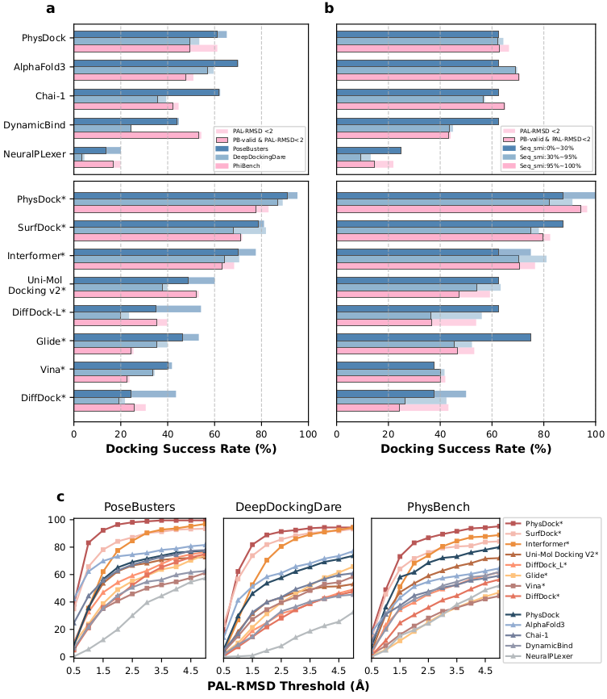

# PhysDock: A Physics-Guided All-Atom Diffusion Model for Accurate Protein-Ligand Complex Prediction

---

```shell
****************************************************************************
*    ██████╗ ██╗  ██╗██╗   ██╗███████╗██████╗  ██████╗  ██████╗██╗  ██╗    *
*    ██╔══██╗██║  ██║╚██╗ ██╔╝██╔════╝██╔══██╗██╔═══██╗██╔════╝██║ ██╔╝    *
*    ██████╔╝███████║ ╚████╔╝ ███████╗██║  ██║██║   ██║██║     █████╔╝     *
*    ██╔═══╝ ██╔══██║  ╚██╔╝  ╚════██║██║  ██║██║   ██║██║     ██╔═██╗     *
*    ██║     ██║  ██║   ██║   ███████║██████╔╝╚██████╔╝╚██████╗██║  ██╗    *
*    ╚═╝     ╚═╝  ╚═╝   ╚═╝   ╚══════╝╚═════╝  ╚═════╝  ╚═════╝╚═╝  ╚═╝    *
****************************************************************************
```

`PhysDock` is a **physics-guided** **all-atom** **denoising diffusion model** designed for predicting flexible protein-ligand complex structures. 

This repo is Implemented by KexinZhang (zhangkx2022@shanghaitech.edu.cn) & JialeYu (yujl2022@shanghaitech.edu.cn).

## Overview

PhysDock is a non-equivariant **physics-guided** all-atom denoising diffusion model designed for predicting flexible protein-ligand complex structures. 


<center>PhysDock Overview</center>

Currently, PhysDock supports **multi protein chains** and **only one small molecule ligand** input.

## Installation

* PhysDock needs to search the MSAs for the protein sequence of the receptor. Therefore, the corresponding tools need to be installed and five databases must be prepared.

```shell
# Install Bio Tools
apt install hhsuite hmmer

# Download Databases
sh scripts/download_homo_datasets.sh <target_databases> # For example, $HOME/libs
```

* We provide a conda `.yaml` file to create environment to run PhysDock

```shell
# Create ENV
conda env create -f enviroment.yaml

# ENV Activation
conda activate PhysDock
```

* Download model params from zenedo and move it to `params` dir.

```shell
# Download latest EMA Params
cd params
wget https://zenodo.org/records/15178859/files/params.pt
```

## Inference

PhysDock provides convenient inference scripts for two scenarios: **redocking** and **virtual screening** (VS). Prior to redocking and VS, it is necessary to conduct corresponding preprocessing on a system. Subsequently, the cached files obtained from preprocessing are used for complex structure prediction and ranking.

### System Preparation

In PhysDock, a system encompasses one or more receptor chains along with a ligand. The input is **a `.pdb` file** of receptor and a `.sdf` file of ligand, while the output consists of the raw features (`.pkl.gz` file) for model input, typically structural-related features. In addition to structural features, PhysDock generates MSA-related features, including `msa_feature` and `uniprot_msa_feature`, by searching all sequence databases. We utilize the **MD5 encoding** of the protein sequence as a query to reuse the MSA features. Moreover, the raw feature can also encompass key residues involved in interactions processed by **PLIP**, and specify high-importance key residues with a certain probability during inference.

Below is an example of system preparation of demo input system.

```shell
BASE=$(dirname $0)

# Generate systems pkl.gz
# The receptor pdb and ligand sdf and ligand CCD id are inputs.
# The output is a system `pkl.gz`
python $BASE/prepare_system.py \
  --receptor_pdb_path $BASE/demo/system_preparation/receptor.pdb \
  --ligand_sdf_path $BASE/demo/system_preparation/EJQ.sdf \
  --ligand_ccd_id EJQ \
  --systems_dir $BASE/demo/system_preparation/systems

# Get MSA features
python $BASE/run_homo_search.py \
  --input_fasta_path $BASE/demo/system_preparation/systems/fastas \
  --features_dir $BASE/demo/system_preparation/features \
  --bfd_database_path <target_databases>/bfd/bfd_metaclust_clu_complete_id30_c90_final_seq.sorted_opt \
  --uniclust30_database_path <target_databases>/uniclust30/uniclust30_2018_08/uniclust30_2018_08 \
  --uniref90_database_path <target_databases>/uniref90.fasta \
  --mgnify_database_path <target_databases>/mgy_clusters.fa \
  --uniprot_database_path <target_databases>/uniprot.fasta \
  --jackhmmer_binary_path /usr/bin/jackhmmer \
  --hhblits_binary_path /usr/bin/hhblits

```

### Redocking

The redocking procedure can refer to the following script `redocking_demo.sh`.

```shell
# Run Demo
sh redocking_demo.sh
```

```python
# redocking_demo.sh
BASE=$(dirname $0)

python $BASE/redocking.py \
  -i $BASE/examples/demo/Posebusters_subset \
  -f $BASE/examples/demo/features \
  --crop_size 256 \
  --atom_crop_size 2048 \
  --enable_physics_correction \
  --use_pocket \
  --use_key_res \
  --enable_ranking
```

```python
# Get Help Info
python redocking.py -h
```

### Virtual Screening

The VS procedure can refer to the following script `screning.sh`.  Here, it should be noted that when conducting screening for a specified pocket, the position of the ligand in the system `.pkl.gz` file (from System Preparation procedure) will serve as the search area for the pocket.

```shell
# Run Demo
sh screening_demo.sh
```

### Full Docking Pipeline

```shell
# Run full pipeline
sh docking_demo.sh
```

### Other application scenarios

Other application scenarios, such as blind docking, cross docking or standard precision (SP) flexiable docking can be implemented by specifying different parameters of python scripts. 

## Available Data

The training dataset, the preprocessed benchmark dataset, and the prediction results presented in the paper can be obtained through the following scripts from zenodo.

### Benchmark Data

* PhysDock acheives **SOTA** redocking results in three benchmarks. 



* The preprocessed benchmark dataset can be download through following script.

```shell
# Download all the preprocessed benchmark dataset including Posebusters, DeepDockingDare and PhiBench.
sh scripts/download_benchmarks.sh
```

* The training and validation dataset can be download by the following scripts

```shell
sh scripts/download_dataset.sh
```


## Citation

If you want to cite this work, please use the following `bibtex`

```text
@article{zhang2025physdock,
  title={PhysDock: A Physics-Guided All-Atom Diffusion Model for Protein-Ligand Complex Prediction},
  author={Zhang, Kexin and Ma, Yuanyuan and Yu, Jiale and Luo, Huiting and Lin, Jinyu and Qin, Yifan and Li, Xiangcheng and Jiang, Qian and Bai, Fang and Dou, Jiayi and others},
  journal={bioRxiv},
  pages={2025--04},
  year={2025},
  publisher={Cold Spring Harbor Laboratory}
}
```

### License

[MIT License](./License)
